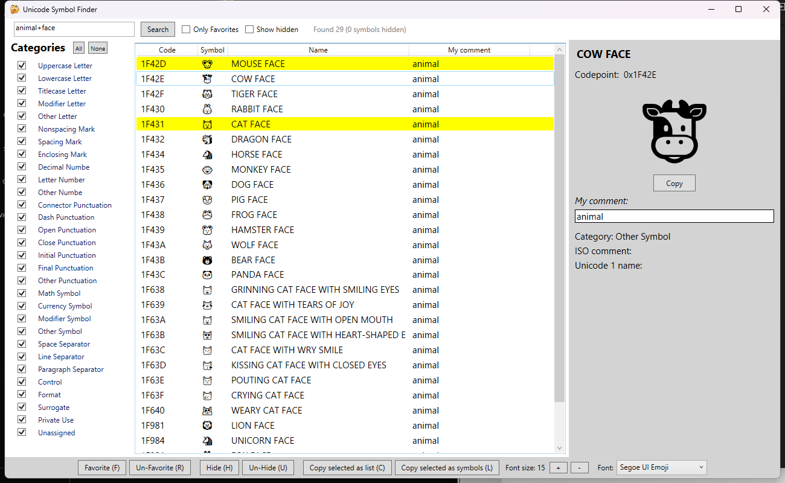

# Unicode Symbol Finder

Search for unicode symbols by name, code or custom comment, and copy them to your clipboard.

## Search

Searching is done on the Unicode symbol's Code Point, Name or personal Comment.
- Code Point: the hex code of the symbol, search *without* 0x or \u in front, just use the hex number (e.g. 1F604 not 0x1F604)
- Name: The name set by Unicode for the symbol
- Comment: an editable value

Searching with no input shows all symbols in the list.

### Search Favorites
If Only Favorites is checked, any non-favorited symbols are hidden in the search

### Search Hidden symbols
If Show Hidden is not checked, any symbols marked as hidden are not shown in the search result.
If Show Hidden is checked, all symbols are shown, but hidden items are grayed out to distinguish them.

## Advanced search

By adding + or - in front of search terms you can require all terms or exclude terms from your search.  
For example, searching for the following will show all smiling faces except cats, if "eyes" is in the name.

    face+smiling-cat+eyes

    0x1F601	😁	GRINNING FACE WITH SMILING EYES
    0x1F604	😄	SMILING FACE WITH OPEN MOUTH AND SMILING EYES
    0x1F606	😆	SMILING FACE WITH OPEN MOUTH AND TIGHTLY-CLOSED EYES
    0x1F60A	😊	SMILING FACE WITH SMILING EYES
    0x1F60D	😍	SMILING FACE WITH HEART-SHAPED EYES
    0x1F619	😙	KISSING FACE WITH SMILING EYES
    0x1F92D	🤭	SMILING FACE WITH SMILING EYES AND HAND COVERING MOUTH
    0x1F970	🥰	SMILING FACE WITH SMILING EYES AND THREE HEARTS

## Categories

The left panel lists all Unicode symbol categories. To narrow your search, enable or disable unwanted search categories.

To more easily find emojis, click the None button, and enable "Other Symbol" before you search.

## Favorites

Favorite symbols are highligted in yellow.

- Select one or more symbols and press the "Favorite" button or the F key to tag them as a favorite.
- Remove the favorite status from a symbol by clicking "Un-Favorite" or the R key.

## Hidden symbols

Symbols marked as hidden are not shown when searching the list, or grayed out if "Show Hidden" is checked.

By hiding large or small parts of the list you don't care about, you can more easily find the ones you need. For instance hiding symbols for languages you don't use.  

- Hide one or more selected symbols by clicking the Hide button or the H key.
- Un-Hide selected symbols by clicking Un-Hide or the U key

## Personal comments

The comments field can help categorize and find symbols more easily. The default symbol names often miss common descriptors for a symbol, such as altenate names or useful group descriptors.

You can select multiple symbols at once and edit the comment on all of them in one go.

## Display Font

Change the font and text size in the search results using the buttons and drop down in the lower right.

This does not affect the values copied to the clipboard, since that uses plain unformatted text.

## Saved values

Custom comments, favorites and hidden symbols are saved to a file in the application's data subfolder:
    data\symbols.txt

To remove any preset favorites or hidden symbols, either select all symbols in the application or delete this file. Deleting the file also deletes any useful comments on the symbol.

## Loading updated unicode symbols

Download the newest unicode symbols file from:
https://www.unicode.org/Public/UNIDATA/UnicodeData.txt

Delete the existing symbols.txt in the application's *data* folder, and replace the UnicodeData.txt with the newer file.

This will fully replace your saved information, removing any comments, favorites and hidden tags.

## Screenshot

